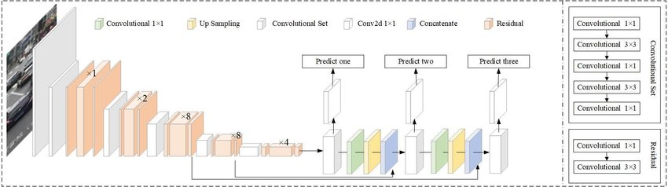

# yolo-detection-model

#### YOLO Architecture
You Only Look Once (YOLO) which first came on the computer vision scene with the seminal 2015 paper by Joseph Redmon et al [You Only Look Once: Unified, Real-Time Object Detection](https://arxiv.org/abs/1506.02640) is one of the most effective object detection algorithms in computer vision domain since it achieves high accuracy while also being able to run in real-time.

YOLO uses convolutional neural network (CNN) for doing object detection in real-time. The algorithm applies a single neural network to the full image, and then divides the image into regions and predicts bounding boxes and probabilities for each region. These bounding boxes are weighted by the predicted probabilities.The algorithm “only looks once” at the image in the sense that it requires only one forward propagation pass through the neural network to make predictions. After non-max suppression (which makes sure the object detection algorithm only detects each object once), it then outputs recognized objects together with the bounding boxes.

[YOLOv3](https://arxiv.org/abs/1804.02767v1) came as imporvement on the original paper since YOLOv1 was not accurate with small objects. 

                                            Architecture

#### Implementation
I have used pre-trained weights on COCO dataset and configuration file which can be downloaded from [here](https://pjreddie.com/darknet/yolo/).

